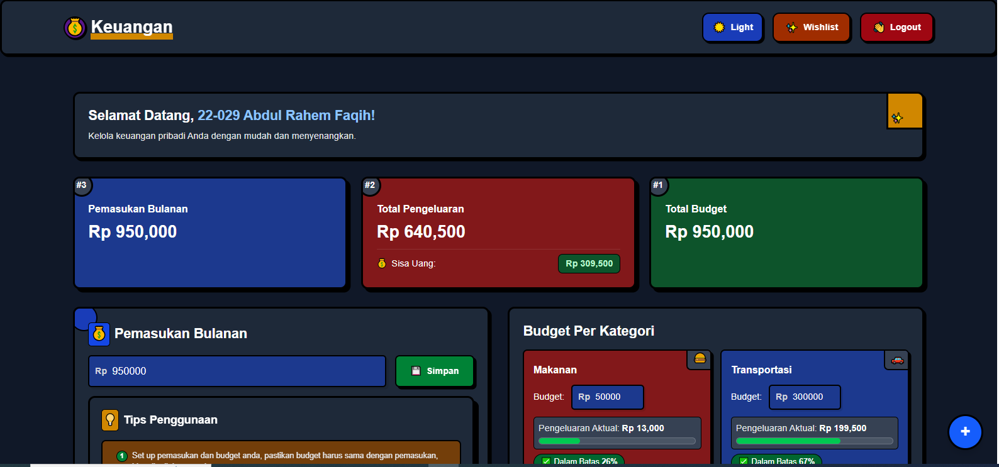

# Catat Pengeluaran Anda



Sebuah aplikasi web yang dirancang untuk membantu Anda mencatat dan mengelola pengeluaran harian dengan mudah dan efektif.

## Tentang Aplikasi

"Catat Pengeluaran Anda" adalah aplikasi pengelolaan keuangan pribadi yang memungkinkan pengguna untuk mencatat, mengatur budget pengeluaran perkategori, dan menganalisis pengeluaran anda tiap bulan. Aplikasi ini menyediakan visualisasi data yang memudahkan pengguna untuk memahami pola pengeluaran mereka dan membuat keputusan keuangan yang lebih baik.

## Fitur Utama

- ✅ Pencatatan pengeluaran harian
- 🗂️ Kategorisasi pengeluaran
- 🔐 Autentikasi pengguna
- 🔑 Integrasi dengan Google Authentication
- 📆 Laporan pengeluaran perbulan, dan terdapat export pdf
- 📱 Responsif di berbagai perangkat, Dark Mode Support
- 🎇 Fitur Baru: Kelola Wishlist anda

## Cara Instalasi

### Prasyarat
- Node.js (versi 14 atau lebih tinggi)

### Langkah-langkah instalasi

1. Clone repository front-end:
```bash
git clone https://github.com/abdulrahemfaqih/fe-catat-pengeluaran-anda.git
cd fe-catat-pengeluaran-anda
```

2. Install dependencies:
```bash
npm install
# atau
yarn install
```

3. Setup file konfigurasi:
```bash
cp .env.example .env
```

4. Edit file `.env` dengan konfigurasi sesuai kebutuhan Anda, pastikan URL backend sudah benar.

5. Jalankan aplikasi:
```bash
npm run dev
# atau
yarn dev
```

6. Aplikasi akan berjalan di `http://localhost:5173` (atau port lain sesuai konfigurasi).

## Backend Repository

Backend untuk aplikasi ini tersedia di repository berikut:
[Backend Catat Pengeluaran Anda](https://github.com/abdulrahemfaqih/be-catat-pengeluaran-anda)

## Demo Aplikasi

Anda dapat melihat demo live aplikasi "Catat Pengeluaran Anda" di:
[Live Demo](https://catat-pengeluaran-anda.vercel.app)


## Kontribusi

Kontribusi dari komunitas sangat dihargai! Silakan buat pull request atau laporkan issue jika Anda menemukan bug atau memiliki ide untuk pengembangan aplikasi.

## Lisensi

[MIT License](LICENSE)